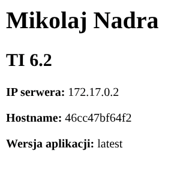
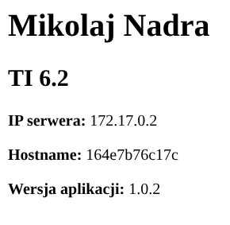
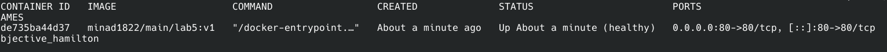
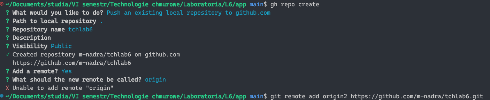
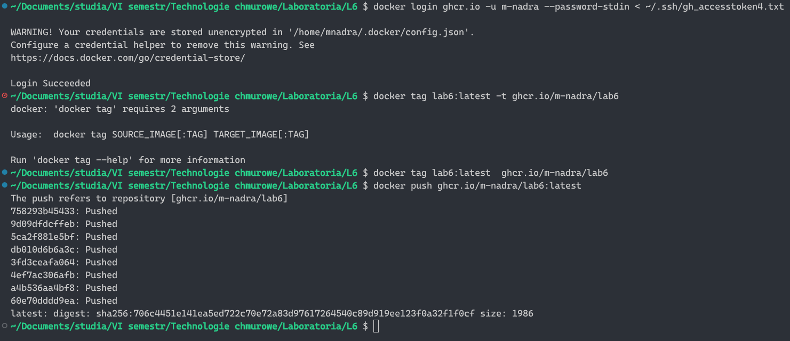

# Technologie chmurowe - lab 5 i lab 6 - Mikołaj Nadra TI 6.2

### Laboratorium 5

Link do DockerHub: https://hub.docker.com/repository/docker/minad1822/main/tags/lab5/

Polecenie budujące obraz:
- bez podania VERSION (wstawia domyślne słowo "latest")
    ```bash
    docker build -t minad1822/main:lab5 .
    ```
    
- z podaniem VERSION
    ```bash
    docker build --build-arg VERSION=1.0.2 -t minad1822 main:lab5 .
    ```
    

Potwierdzenie wykonania HEALTCHECKA: 


### Laboratorium 6



Obraz został utworzony za pomocą polecenia: 

```bash
docker build --ssh default . -t lab6
```

Wcześniej uruchomiłem agenta ssh i dodałem klucz SSH do GitHuba.

---
Polecenia wypychające obraz do ghcr.io

